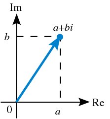

First, let's just generally talk about rotations.

* Euler angles
  * Rotation matrix for each axis, apply
  * Order can be anything
* Rotation matrix
  * The columns form the basis vectors
  * Orthonomal basis vectors


## Rotation Interpolation

The familiar methods of rotation representation will not work!
What are those methods?

* Euler angles
* Rotation matrix

Euler angles absolutely won't work and will look bad (not constant angular velocity).
Euler angles are also also susceptible to gimbal lock.
Rotation matrices have basically the same problem with regard to interpolation.
It can be solved but is math heavy.

However, there is a rotational representation that has a simple way to interpolate!
It's called quaternions.

## Quaternions - Simple Mode

Quaternions can be used to represent a rotation.
And they're in glm!

You can make a quaternion from Euler angles:

```cpp
glm::quat q = glm::quat(euler);
```

And from a rotation matrix:

```cpp
glm::quat q = glm::quat(matrix);
```

And you can easily [interpolated between two quaternions](https://glm.g-truc.net/0.9.0/api/a00135.html#a99e0097254662e3d4d5859fa329762ca):

```cpp
glm::quat q = glm::slerp(q0, q1, 0.5f);
```

And finally, you can get a rotation matrix back from the quaternion:

```cpp
glm::mat4 m = glm::mat4_cast(q);
```


## Quaternions - Math Mode

### Complex Numbers

Recall, complex numbers:

$$ (a, b) = a + b i $$

$$ a $$ is a real number.

$$ i $$ is an imaginary number.

It has some interesting rules: $$ i^2 = -1 $$

So we can multiply two complex numbers following the rules of algebra:

$$ (a + b i) * (c + d i) = $$

$$ a * c + a * d i + b i * c + b i * d i = $$

$$ ac + ad i + bc i + bd i^2 = $$

$$ (ac - bd) + (ad + bc) i $$

We can also write this:

$$ (a, b) * (c, d) = (ac - bd, ad + bc) $$

Alright, what else can we do with complex numbers?
We can plot them in 2D.

{:class="img-thumbnail"}

Doing so shows us a few interesting aspects of complex numbers:

* If we multiply by $$ i $$, the number rotates around 90 degrees.
* If we multiply by $$ -1 = i^2 $$, the number rotates around 180 degrees.

What if we multiply by any other unit-length complex number?

$$ (a, b) * (cos\theta, sin\theta) = (a cos\theta - b sin\theta, a sin\theta + b cos\theta) $$

But wait! This looks like...

$$ \begin{bmatrix}cos \theta & -sin \theta\\sin \theta & cos \theta\end{bmatrix} \begin{bmatrix}a\\b\end{bmatrix} = $$

$$ \begin{bmatrix}a cos\theta - b sin\theta\\a sin\theta + b cos\theta\end{bmatrix} $$

Because it is.

### What about 3D?

This is rotation around a **single axis**, and we need **two** numbers to do it - a real and imaginary part.

We also use *unit-length* complex numbers, not just all of them.

To represent a 3D rotation, with is around **three axis**, we need **four** numbers to do it - a real and three imaginary parts.

[Euler's rotation theorem](https://en.wikipedia.org/wiki/Euler%27s_rotation_theorem) tells us that we can represent any arbitrary rotation in 3D
as a rotation around a single axis $$ \vec e $$ by a given rotation $$ \theta $$.

So we need exactly **four numbers** to describe an arbitrary rotation.
This makes sense!
(I hope).

### Quaternions

Okay so what is this set of four numbers, three of which are imaginary?

$$ i^2 = j^2 = k^2 = ijk = -1 $$

$$ ij = k $$ and $$ jk = i $$ and $$ ki = j $$

$$ ji = -k $$ and $$ kj = -i $$ and $$ ik = -j $$

This forms an extended version of the complex numbers:

$$ w + xi + yj + zk $$

We can write the coordinates this way:

$$ (w, x, y, z) $$

Or as a scalar and vector pair:

$$ (w, \vec v) $$

How can we represent a rotation with this?

$$ w = cos(\frac{\theta}{2}) $$

$$ (x, y, z) = \vec v = sin(\frac{\theta}{2} \hat r) $$

