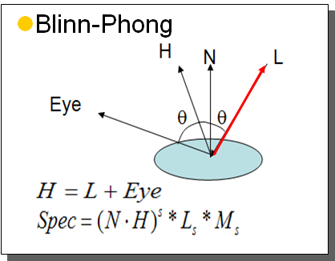

<a href="https://docs.google.com/presentation/d/1NUknkIE4VqjbmlcW5crsz1d4DebWjQm0xl54ZkT-uZA/edit?usp=sharing" class="btn btn-info">Slide Deck</a>

Lighting and Shading Review
---------------------------

- [471 Color Vision Lecture](https://iondune.github.io/csc471/lectures/15-lighting-1)
- [471 Reflection Models Lecture](https://iondune.github.io/csc471/lectures/16-lighting-2)
- [471 Lighting and Shading Wrapup Lecture](https://iondune.github.io/csc471/lectures/17-lighting-3)

Advanced Texturing
------------------

Resources:

* [Normal Mapping](https://learnopengl.com/Advanced-Lighting/Normal-Mapping)
* [Percentage Closer Filtering](https://developer.nvidia.com/gpugems/GPUGems/gpugems_ch11.html)
