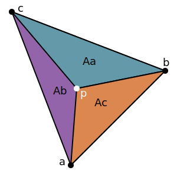

<a href="https://docs.google.com/presentation/d/1Ac94J0LqbAwgAP9y1lmzKGhHOp7kZWkvyJc2uNbhADg/edit?usp=sharing" class="btn btn-info">Slide Deck - Dr. Sueda</a>

We're going to use triangles a lot this quarter.
So we need a way to figure things out about triangles.
One thing we're definitely going to test is whether certain points are inside a triangle or not,
but we'll also need to answer other questions, like what color a part of a triangle is.

The idea behind **Barycentric Coordinates** is that we're going to use three numbers to describe the position of a point in relation to a specific triangle.
These numbers represent more or less the "closeness" to each vertex -
if a point is really close to vertex A of a triangle and far from B and C,
we would say that the barycentric coordinates of the point are, say,
98% A, 1% B, and 1% C.

## Basics

Barycentric coordinates of point $$ p $$ in terms of $$ a $$, $$ b $$, and $$ c $$
are the numbers $$ \alpha $$, $$ \beta $$, and $$ \gamma $$ such that:

$$ p = \alpha * a + \beta * b + \gamma * c $$

With the constraint:

$$ \alpha + \beta + \gamma = 1 $$

This **must** be true if the three values are barycentric coordinates.

However, the values don't have to be positive.

A point $$ p $$ is inside the the triangle if and only if:

$$ 0 \leq \alpha \leq 1 $$

$$ 0 \leq \beta \leq 1 $$

$$ 0 \leq \gamma \leq 1 $$

What does $$ \alpha = 0 $$ mean? Any point opposite the vertex $$ a $$, or rather along the line from $$ b $$ to $$ c $$.

What about $$ \alpha, \beta = 0 $$? In this case we know $$ \gamma $$ must be $$ 1 $$, this is the $$ c $$ vertex.

The center of the triangle is $$ \alpha = \beta = \gamma = \frac{1}{3} $$

## Cartesian to Barycentric

Barycentric coordinates are a ratio of areas.

Where the total area of the triangle is simply $$ A $$, and each of the points is:

$$ a = \{ x_a, y_a \} $$

$$ b = \{ x_b, y_b \} $$

$$ c = \{ x_c, y_c \} $$

$$ p = \{ x, y \} $$

Given these areas, we can compute the Barycentric coordinates:

$$ \alpha = A_a / A $$

$$ \beta = A_b / A $$

$$ \gamma = A_c / A $$

We can compute these areas using a 2D cross product\*.

\*Note: There is technically no such thing as a 2D cross product.
But we will revisit cross products in a couple of weeks, and the formulas are useful to use here.

The cross product gives the area of a parallelogram formed by two vectors, so for the area of a given triangle we want $$ \frac{1}{2} $$ of the cross product.

**Be careful:** The choice of both which edges to use and the order to use them is very important!
There are many possible correct choices, but there are also many possible incorrect ones.
*Use the values I have below to avoid confusion*.

To compute the total area $$ A $$ as:

$$ A = \frac{1}{2} (b - a) \times (c - a) $$

$$ A = \frac{1}{2} \begin{vmatrix}x_b - x_a & x_c - x_a\\y_b - y_a & y_c - y_a\end{vmatrix} $$

To compute the small triangle area $$ A_b $$ as:

$$ A_b = \frac{1}{2} (a - c) \times (p - c) $$

$$ A_b = \frac{1}{2} \begin{vmatrix}x_a - x_c & x - x_c\\y_a - y_c & y - y_c\end{vmatrix} $$

To compute the small triangle area $$ A_c $$ as:

$$ A_c = \frac{1}{2} (b - a) \times (p - a) $$

$$ A_c = \frac{1}{2} \begin{vmatrix}x_b - x_a & x - x_a\\y_b - y_a & y - y_a\end{vmatrix} $$

Computing the determinants is left as exercise for the reader :-)

Except I'll share the solution for A here:

$$ A = \frac{1}{2} \begin{vmatrix}x_b - x_a & x_c - x_a\\y_b - y_a & y_c - y_a\end{vmatrix} $$

$$ = \frac{1}{2} ( (x_b - x_a) * (y_c - y_a) - (x_c - x_a) * (y_b - y_a) ) $$

Finally, we can compute $$ \alpha $$ from $$ \beta $$ and $$ \gamma $$:

$$ \alpha = 1 - \beta - \gamma $$

## Area Example

  <iframe id="exampleFrame" src="03-example-barycentric-area.html" width="720px" height="720px"></iframe>

Thank you to Dr. Zoe Wood for the above Processing example!

## Interpolation

Now we can use $$ \alpha, \beta, \gamma $$ to interpolate colors and depth of the triangle.

In general the barycentric coordinates can be used to interpolate anything across the triangle.
For vertex colors, we will specify $$ r, g, b $$ values for each point to represent the
**red**, **green**, and **blue** values of each vertex.

To interpolate these colors values across the triangle, we must interpolate each "channel" individually.

$$ r\prime = \alpha r_a + \beta r_b + \gamma r_c $$

$$ g\prime = \alpha g_a + \beta g_b + \gamma g_c $$

$$ b\prime = \alpha b_a + \beta b_b + \gamma b_c $$
