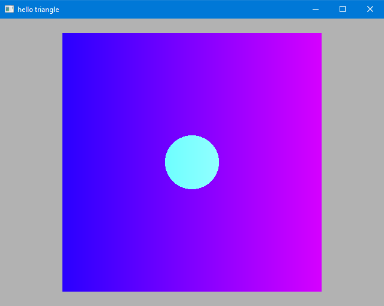

In this lecture we will modify the base code for Lab 3 to draw an animated, colored rectangle.

[You can find the source code for this lab here.](https://github.com/calpoly-csc471/FragShaderDemo)


## 1: Rectangle

First, let's replace the triangle with a rectangle.

We'll find the `g_vertex_buffer_data` variable and add a second triangle to it.

```cpp
static const GLfloat g_vertex_buffer_data[] =
{
	-0.9f, -0.9f, 0.0f,
	 0.9f, -0.9f, 0.0f,
	 0.9f,  0.9f, 0.0f,

	-0.9f, -0.9f, 0.0f,
	 0.9f,  0.9f, 0.0f,
	-0.9f,  0.9f, 0.0f,
};
```

We'll also need to update the number of vertices we draw, from 3 to 6.

```cpp
glDrawArrays(GL_TRIANGLES, 0, 6);
```

While we're at it, let's change the background color to something a little more subtle.

```cpp
glClearColor(0.7f, 0.7f, 0.7f, 1.0f);
```


## 2. Index Buffer

Let's add an index buffer so that we can send only **four** vertices to render our quad
(without the two duplicated vertices we currently have).


In addition to our `GLuint VertexBufferID;` declaration, let's add a new handle for our index buffer:

```cpp
GLuint IndexBufferID;
```

Now change the contents of the vertex data to only contain the four vertices we need:

```cpp
static const GLfloat g_vertex_buffer_data[] =
{
	-0.9f, -0.9f, 0.0f,
	 0.9f, -0.9f, 0.0f,
	 0.9f,  0.9f, 0.0f,
	-0.9f,  0.9f, 0.0f,
};
```

We need to create our index buffer object (IBO) and upload the data.
Do this at the end of the `initGeom()` function, but
**make sure it's before the call that unbinds the VAO**, `glBindVertexArray(0)`.


```cpp
// Create and bind IBO
glGenBuffers(1, &IndexBufferID);
glBindBuffer(GL_ELEMENT_ARRAY_BUFFER, IndexBufferID);

static const GLuint g_index_buffer_data[] =
{
	0, 1, 2,
	0, 2, 3
};
glBufferData(GL_ELEMENT_ARRAY_BUFFER, sizeof(g_index_buffer_data), g_index_buffer_data, GL_DYNAMIC_DRAW);
```

Note that the index data references one triangle on vertices `0`, `1`, and `2`,
and one triangle on vertices `0`, `2`, and `3`.

We also need to modify the draw call to use the index buffer. Find the `glDrawArrays(...)` call and replace it with:


```cpp
glDrawElements(GL_TRIANGLES, 6, GL_UNSIGNED_INT, nullptr);
```

The number `6` refers to the 6 elements in our index buffer.


## 3. Add Some Color

Now that the setup work is done, let's add some more interesting colors.

In the **fragment shader** we have access to a built-in variable called `gl_FragCoord`.
But this variable gives us the location of the current pixel in pixel coordinates.

In order to use this we need to know the dimensions of the window in our fragment shader.
To pass information of this nature to our shader, we use a variable called a **uniform**.

A uniform is so called because it is a variable that has the same value for all vertices
and all fragments within a single render command.

First, go to the `init(...)` function and add a new line to add a uniform:


```cpp
prog->addUniform("uWindowSize");
```

Next, go to the `render(...)` function and find the `glUniform______` calls.
Add a new one to upload the window size (width and height):

```cpp
glUniform2f(prog->getUniform("uWindowSize"), (float) width, (float) height);
```

Now we have access to a uniform variable called `uWindowSize` in our shaders.
We're going to use it in the fragment shader.
Open up `simple_frag33.glsl` and add this line before `void main()`:


```glsl
uniform vec2 uWindowSize;
```

Now we can use the window size to color the quad based on horizontal position:

```glsl
color.r = gl_FragCoord.x / uWindowSize.x;
```

This will make a gradient that goes from blue on the left to magenta on the right.

We can also add some logic to color all pixels within 45 pixels of the center of the screen:

```glsl
vec2 center = uWindowSize / 2.0;
if (length(gl_FragCoord.xy - center) < 45.0)
{
	color.g = 1.0;
}
```

The full shader should now look like this:


```glsl
#version 330 core

uniform vec2 uWindowSize;
out vec3 color;

void main()
{
	color = vec3(0.0, 0.0, 1.0);

	color.r = gl_FragCoord.x / uWindowSize.x;

	vec2 center = uWindowSize / 2.0;
	if (length(gl_FragCoord.xy - center) < 45.0)
	{
		color.g = 1.0;
	}
}
```

And the result should look like this:





## 4. Animation

Now lets add some motion to our rectangle.
Since motion occurs over time, we need to make the current time available to our shaders.

First, let's make another **uniform** to hold the current time.

```cpp
prog->addUniform("uTime");
```

```cpp
glUniform1f(prog->getUniform("uTime"), glfwGetTime());
```

`glfwGetTime` gives us the time since the program has started, in seconds.

Next we will use this variable in our vertex shader:

```glsl
uniform float uTime;
```

And change the position of our vertices based on the current time:


```glsl
const float radius = 0.1;

vec3 position = vertPos;
position.x = position.x + radius * cos(uTime);
position.y = position.y + radius * sin(uTime);

gl_Position = P * MV * vec4(position, 1.0);
```

The full vertex shader should look like this:

```glsl
#version 330 core

layout(location = 0) in vec3 vertPos;

uniform mat4 P;
uniform mat4 MV;
uniform float uTime;

void main()
{
	const float radius = 0.1;

	vec3 position = vertPos;
	position.x = position.x + radius * cos(uTime);
	position.y = position.y + radius * sin(uTime);

	gl_Position = P * MV * vec4(position, 1.0);
}
```

And if we fire up the application, the rectangle should now be moving around in a circular motion.

This example uses the **parametric equation** of a circle which looks like this:

$$ x = c_x + r * cos(\theta) $$

$$ y = c_y + r * sin(\theta) $$

Here we are using the current time as $$ \theta $$, so the resulting animation follows a circular path.


## 5. Better Animation

The vertex shader lets us operate on each vertex individually, but when all the vertices move in the same way
it just looks like the whole rectangle is moving.

That's boring.

Let's make it so that two of the vertices move in the opposite direction of the other two.


We'll do this by sending some additional vertex data.
We could add another VBO, or add a fourth element to our `vec3` position, but right now we're not really using the
`z` value, so let's just hide some information there.

```cpp
static const GLfloat g_vertex_buffer_data[] =
{
	-0.9f, -0.9f,  1.0f,
	 0.9f, -0.9f, -1.0f,
	 0.9f,  0.9f,  1.0f,
	-0.9f,  0.9f, -1.0f,
};
```

Now in the vertex shader, let's modify two lines:

```glsl
position.x = position.x + radius * cos(uTime) * vertPos.z;
position.y = position.y + radius * sin(uTime) * vertPos.z;
```

Now if we open up the application, the rectangle should be doing more of a warping/distorting animation than simply moving in a circle.

