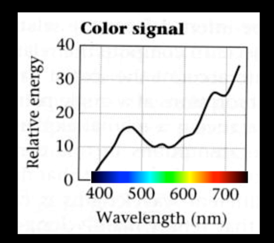
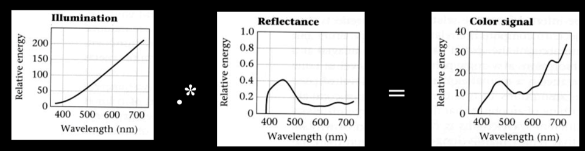
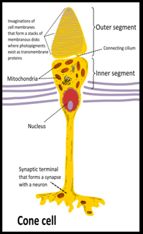
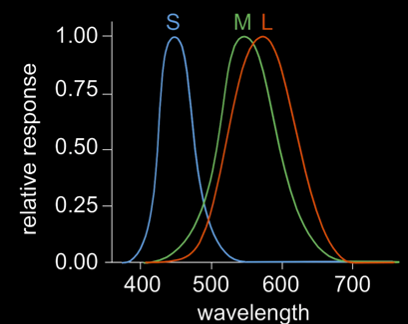
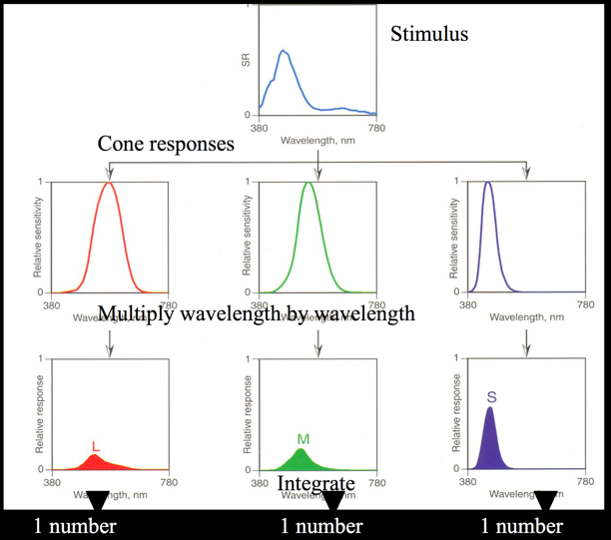
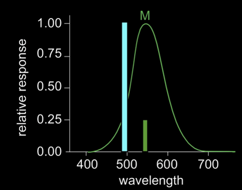
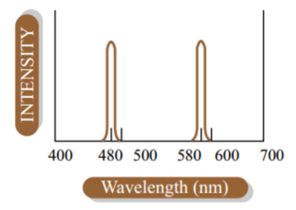

<a href="https://docs.google.com/presentation/d/1h7SDIqSg65Dhmk5JUjy2eDYeFzDlshwJR6g7AbW9rzs/edit?usp=sharing" class="btn btn-info">Color Vision Slides</a>
<a href="https://docs.google.com/presentation/d/1HOH6K5gQsiKgZ8JCTKvI9qUXOKuzuGs4Mef0cGv-tYQ/edit?usp=sharing" class="btn btn-info">Color Spaces Slides</a>

## Color and Light

**Light** is both a wave and a particle.
That's just some quantum mechanics nonsense.
But in computer graphics we are concerned with some of the details that arise from this.

First, the **wavelength** of this wave tells us the color of the light.
Visible light ranges from 450nm to 700nm.
450nm is  and 700nm is .

Light is characterized by its spectrum: the amount of energy at each wavelength.

This is a full distribution: one value per wavelength (infinite number of values).

To understand light and illumination, we need to understand two things.

**(1)** What does it mean for an object to have color?

**(2)** What happens when light hits our eyes?

Let's talk about the second part, then go back to the first part.

## Reflectance

When light hits an object, it reflects off of it.

The light source has a **spectrum**: a distribution of light at different wavelengths/frequencies with different power.
If the light source has more or less equal power across all visible light wavelengths/frequencies, it is a white light.
A red light would have more power in the red wavelengths and less power in the green and blue wavelengths.

Note that when I say "red", "green", and "blue" here I am grouping areas of the spectrum into three areas,
but in reality there is no such grouping.
This is a continuous spectrum.

The object that the light hits also has a spectrum - a reflectance spectrum or **spectral albedo**.
All this means is that the object might reflect more of a certain type of light.
Other light is absorbed.

A red object absorbs blue and green light, but reflects red light.
That's why it looks red - red light is the only light we see coming off of it.

The two spectra (the light source's and the object's) get multiplied together to determine the color signal received by the viewer.

For example, if sunlight hits a blue object, the reflected light will be mostly blue.

Note that this blue object still reflects some red light, just not nearly as much as blue.

## Color Vision

### Simple and Ultimately Wrong Version

You have red, green, and blue cones.
Red cones see red light, green cones see green light, blue cones see blue light.

If you see  and ,
your brain says "!"

This is a (reasonable) guess based on how yellow is inbetween red and green in the spectrum.

All of , , and  cones? White.

None of the cones? Black.

Just  and ? .

 and ? .

Wait...

Our brains know that something is up when we see red and blue at the same time.
The middle is green... but instead our brain makes up a color.
!

Pink is not on the spectrum.

Red and violet are... but a mix of these colors is not on the spectrum.

That doesn't mean that Pink isn't a color, though.
Color is just the word we use to describe how our brains interpret light.
Pink is one of the ways that our brain interprets light, so it's a color.
It is called a [non-spectral color](https://en.wikipedia.org/wiki/Spectral_color#Non-spectral_colors).
There are many other examples.

### Now A More Accurate Version

You have eyes.

In your eyes there are cones.

There are three types of cones but they are not as simple as red, green, and blue.
They are called L, M, and S cones and they each have sensitivity to certain frequencies.

There is some overlap between different sensitivity regions.
But the "cones" don't see anything.
They just relay information to your brain.
Your brain has to take this information and deduce what color you are seeing.

### Cone Response

Light that enters our eyes is (typically) a full distribution of wavelength values.
You can think of this as an infinite number of values, one per each possible wavelength.
Our brain ends up with 3 values, one per cone type.

Note that cones can give the same response for a different wavelength and different intensity.

However, the different cone types will respond differently to this signal.

This is how our brain can figure out the difference between colors.
But it is also clearly not a perfect system.

  By the way, many types of color blindness are caused by either malfunctioning or missing cones of a certain type.
  You can see how this wouldn't necessarily result in an individual being unable to see certain colors,
  but would inhibit their ability to distinguish colors.

  For example, the most common type of color blindness is "Deuteranomaly",
  in which the M or "green" cones sensitivity is shifted slightly towards red.
  Individuals with deuteranomaly can still see red and green, but can have trouble distinguishing them.

Consider the following spectra:

These are clearly different amounts of lights (different spectral power distributions)
and yet they will illicit the same response in our relatively simple color vision system.
Such colors (which match in perception but not in frequency distribution) are called **metamers**.

The good news is that this allows us to use a handful of colors to reproduce all (really, "most", but let's call it "all") colors.

## Color Opponent Process

While we're at it, it's worth talking about another mechanism of color vision.
After the cones are activated by light, the response is received by **retianl ganglion cells**.
These cells come in three varieties: **magneta-green**, **blue-yellow**, and **black-white**.

This is why there is no such thing as "red-ish green" or "blue-ish yellow".
Our abilitiy to see colors is based on the signals from these cells.
A combination of magenta and green simply cancels out to no signal, or white.

This is also why if you stare at a red image for a long time, when you look away you will see a cyan "afterimage".

## Summary

The main takeaway from this lengthy discussion is that:

**(1)** Human color vision is complicated.

**(2)** Human color vision is imperfect.

**(3)** When it comes to drawing the world, we need to be concerned with how light is absorbed and reflected by media.

We're done with the first two points.
Now we start talking about the third point in more detail,
coming up with some mathematical models to simulate it,
and converting this to GLSL code to draw 3D objects.
