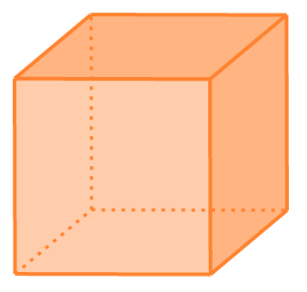
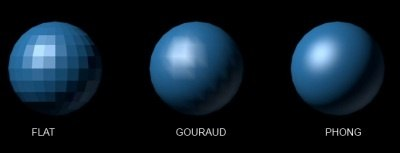

## Surface Normals

- Every triangle is planar
- Every plane has a normal
- Can find the normal of a triangle!

How? Cross product.

### Cross Product


The cross product is defined for 3 dimensional vectors and results in a 3 dimensional vector.

$$ \vec a = \begin{bmatrix}a_x\\a_y\\a_z\end{bmatrix} $$

$$ \vec b = \begin{bmatrix}b_x\\b_y\\b_z\end{bmatrix} $$


$$ \vec a \times \vec b = \begin{bmatrix}a_y b_z - a_z b_y\\a_z b_x - a_x b_z\\a_x b_y - a_y b_x\end{bmatrix} $$

The direction of the resulting vector is determined using the **right-hand rule**
(assuming a right-handed coordinate system, which we are using).

Note that the cross product is anti-commutative.

$$ (\vec a \times \vec b) = - (\vec b \times \vec a) $$

The magnitude of the cross product is the area of the parallelogram formed by $$ a $$ and $$ b $$.

### Triangle Normal

For a triangle formed by vertices $$ A $$, $$ B $$, and $$ C $$, the normal can be found by computing the vertex for two edges:

$$ \vec{AB} \times \vec{AC} $$

Where $$ \vec{AB} = B - A $$


### Mesh Normals

We know how to compute a normal for a triangle and we represent our objects as triangle meshes so this should be simple, right?
The problem is that we don't actually upload any information to the gpu on a per-triangle basis.
We upload vertices, and then use an index buffer to indicate which vertices are connected to form triangles.
And typically each vertex is shared between multiple triangles.

It *is* possible to upload what we'll call **per-face normals** by duplicating each vertex for each triangle it appears in.
This is similar to when we rendered something without an index buffer.
For some objects, this technique is necessary to get the appearance we want.
For example, a cube - each of the six faces of the cube should have a unique normal.
So we don't want to share vertices on the corners of the cube.



But typically we actually want to compute a unique normal vertex, called **per-vertex normals**.
We do this by finding every triangle that a vertex is a part of and averaging all their normals.
This is what you would commonly do to represent the normals of say, a sphere.


Note that for a mesh that contains both hard edges (like a cube) and smooth edges (like a sphere),
it can be difficult to compute normals by any automatic process.
We often rely on the artist and/or the modeling software to provide normals for our meshes
and load them in from whatever mesh file format we are using.


## Implementing Shading

A lot of reflectance equations involve the dot product between two vectors:

$$ (\vec N \cdot \vec L) $$

When implementing this in GLSL, you should first make sure to normalize all vectors that are used in such a way.
For illimunation, we would very rarely if ever want to use a vector of other-than unit length.

```glsl
N = normalize(N);
L = normalize(L);
```

Note that even if you normalize something in a vertex shader, you must re-normalize in the fragment shader.
The interpolation of three normalized vectors is not necessarily normalized.

When computing the dot product, you also want to make sure you don't allow negative numbers.

```glsl
max(dot(N, L), 0.0);
```

There is no such thing as negative light, so we must avoid allowing negative numbers into these computations.
Again, this is the case is all or nearly all computations for illumination - we'll note it carefully if there is an exception.

Since we know that $$ N $$ and $$ L $$ are normalized, the dot product will not be greater than 1.
Even so, for readability and absolute certainty (e.g. to make bugs more noticeable and predictable if we fail to normalize all the vectors),
it's a good idea to **clamp** the value between $$ 0 $$ and $$ 1 $$.

```glsl
clamp(dot(N, L), 0.0, 1.0);
```

This is mathematically equivalent to:

```glsl
min(max(dot(N, L), 0.0), 1.0);
```

But it's far more readable to use the `clamp` function.


## Transforming Normals


When some surface undergoes a non-uniform scale transformation, the normals must be rescaled by the inverse of that scale transformation.
A matrix which contains the same rotation as the model matrix but with the inverse scale is called the **normal matrix**.
We can ignore the translation component of this matrix because we are transforming a normal with `w` component set to $$ 0 $$.

The normal matrix $$ N $$ is constructed by taking the inverse transpose (tranpose of the inverse) of the model matrix:

$$ N = (M^{-1})^T $$

Note that by definition, the inverse-tranpose of any invertable matrix is the same as the tranpose-inverse, so we can effectively do this instead:

$$ N = (M^T)^{-1} $$

Just in case you were curious.

#### Why?

The **reason** why we can't just use the model matrix on the normals is because the normals are not vectors, they are bi-vectors.
When we transform the surface, the effect on the normal is different than how the surface itself is transformed.

If you're curious why the inverse transpose accomplishes what it does, it can be explained somewhat vaguely by noting that:

1. The transpose of a rotation is the inverse of a rotation.
2. The transpose of a scale is the original scale.

So the inverse-transpose of a matrix containing scale and rotation transformations will contain the original rotation but the inverted scale.


## Shading Models

There are three different **shading models** we can choose from.
This is entirely separate from the **reflection models** we have already discussed.
It instead has to do with how and when the shading computation is performed, not the equations used for that computation.



### Flat Shading

In flat shading, we perform the shading computation once per face.
This is not strictly possible in OpenGL, but we can mimic the result by specifying a single normal per face.
I.e. this is what you'll get if you use **per-face normals**.

### Gouraud Shading

In Gouraud shading, we perform the shading computation once per vertex.
Assuming that you have **per-vertex normals**, you can get Gouraud shading by performing the shading computation in the vertex shader.
The shading result is then interpolated across each face and no additional computation is performed in the fragment shader.

### Phong Shading

In Phong shading (confusingly different and separate from the Phong reflection model), we perform the shading computation once per pixel.
You must also have **per-vertex normals** for this.
Simply compute the shading result in the fragment shading, using normals and vectors provided by the vertex shader and interpolated.
