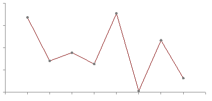
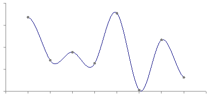

Note that many figures from this presentation come from
[Paul Bourke's excellent article on the same topic](http://paulbourke.net/miscellaneous/interpolation/)
and it would be a good idea to give that a read as well.
Another good reference to read: [http://www.paulinternet.nl/?page=bicubic](http://www.paulinternet.nl/?page=bicubic)

There is a mathematical basis for interpolation that is rather involved.
We're going to mostly ignore it here and just discuss practical applications and equations to use.


## Interpolation

Interpolation is used for a wide variety of things in computer graphics.
It's fundamental to the graphics pipeline - vertex values are interpolated to produce fragment values.

What we're going to talk about today is the animation application of interpolation.

We can use interpolation when we wnat an object to move smoothly from point A to point B.
You may have used interpolation in Program 2B to have part of your model move back and forth between two points.


### Linear Interpolation

The simplest type of interpolation is linear interpolation.
This lets us move along a line in-between two points.

```cpp
float lerp(float x, float y, float t) {
  return x * (1.f - t) + y * t;
}
```

Here, `x` and `y` are the values we are interpolating and `t` is the parameter for the interpolation.
You can think of this as a **time** value in which we are "at" the `x` value at time 0
and we reach the `y` value at time 1.

If your time values are in seconds and you want this animation to take longer than one second,
you'll need to scale your time to get the `t` parameter, something like:

```cpp
currentRotation = lerp(0.0, 3.14, currentTime / 3.0);
```

Also note that if we want to interpolate something like vectors instead of floats,
the function we would need is very similar:

```cpp
glm::vec3 lerp(glm::vec3 x, glm::vec3 y, float t) {
  return x * (1.f - t) + y * t;
}
```

This is thanks to the overloaded multiplication operators for the `glm::vec3` class.


### Interpolating a Path

What if we have more than one point that we want to interpolate between?
We want to go from point A to B to C.

Let's now say that:

- at time 0, we're at point A
- at time 1, we're at point B
- at time 2, we're at point C

Using our lerp function we could do something like this:

```cpp
vec3 modelPosition(vec3 A, vec3 B, vec3 C, float t) {
  if (t < 0.0) {
    return A;
  }
  else if (t < 1.0) {
    return lerp(A, B, t);
  }
  else if (t < 2.0) {
    return lerp(B, C, t - 1.0);
  }
  else {
    return C;
  }
}
```

Doing so for a larger number of points will give us something like this:



This is good, but also the straight lines may not be aesthetically pleasing.
In particular, any model that moves along this path is going to have a sudden change in velocity
when it hits any of the points.

If we were mathematically minded, we might say something about how the derivative of this path
has discontinuities at these locations.


### Cubic Interpolation

What we might want instead is a similar path this is just slightly smoother.
In particular, we want the objects to have smoothly changing velocity near points on the path,
which we'll call **nodes** from now on.

What we want is a cubic interpolation function.



This is what such a function might look like, as a replacement for the `lerp` function we were using before.

```cpp
float cubicInterpolate(
  float x0, float x1,
  float x2, float x3,
  float t)
{
  float a = (3.0*x1 - 3.0*x2 + x3 - x0) / 2.0;
  float b = (2.0*x0 - 5.0*x1 + 4.0*x2 - x3) / 2.0;
  float c = (x2 - x0) / 2.0;
  float d = x1;

  return
    a * t*t*t +
    b * t*t +
    c * t +
    d;
}
```

This function takes four nodes instead of just two like `lerp`.
This is because we need more than just the closest two points to make a smooth path.
The major problem with linear interpolation is that on one side of a point,
we have information about the previous point and the approaching point.
Immediately after that point, we have lost the information about the previous point and now
just have the next point.
By keeping track of four points, we can taper of the "contribution" of each point as they get further away.


## Splines

Using a series of points with a cubic interpolation function like this is called a **spline**.
Historically, the term comes from the use of a flexible piece of wood (a "spline") to draw curved hull shapes in ship design.

There are a lot of different types of splines.
As I said, this is a deep mathematical topic.
Most of the different names seem to have to do with how the spline is represented.
Or sometimes, whether the spline goes through the control points (e.g. an **interpolating** spline)
or whether its shape is merely controlled by the control points.

Mostly you should just be aware that looking for spline equations online involves sifting through a lot of
explanations using slightly different notations and representations.

The most common choice used in computer graphics is the **Catmull-Rom** spline.
This is a spline formed using only a set of input points, instead of needing e.g. derivatives or tangents at each point.
More specifically, in a Catmull-Rom spline the derivatives are calculated implicitly using the input points.

We'll look specifically at three different types of Catmull-Rom Splines.


