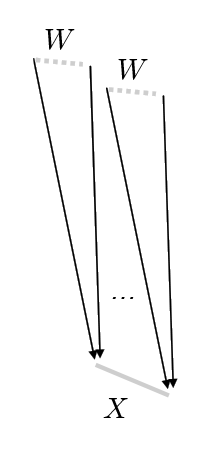
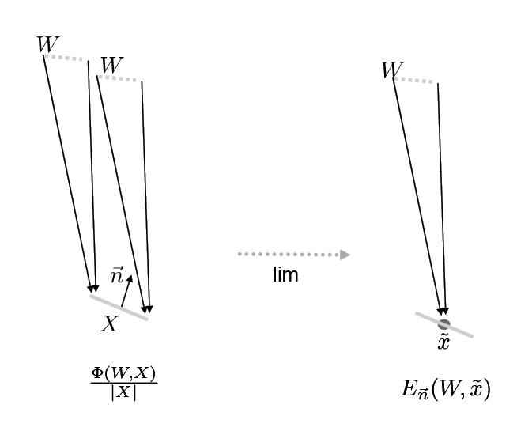
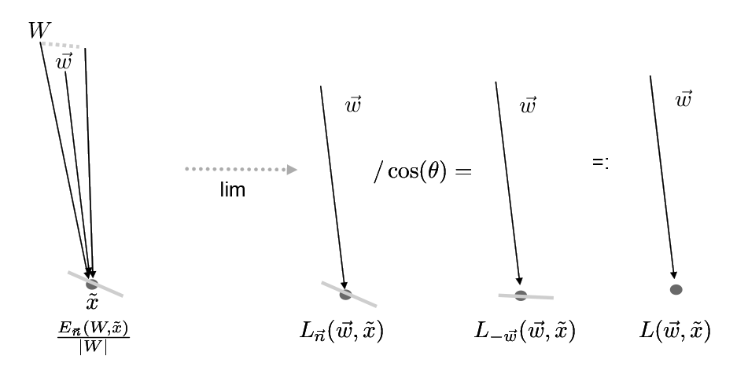

Our goal is to answer "why is ray tracing an OK renderer?"

## Radiometry

Consider light to be photons flying through space.
A photon is an elementary particle - the smallest measurement of electromagnetic radiation a.k.a. light.

{:class="img-thumbnail"}

We imagine that our scene is in a steady state.
In order to **measure light**, we can build a sensor in space, with a physical extent (area) $$ X $$.

Using this sensor we can count the number of photons that pass through $$ X $$ for the directions of the wedge $$ W $$.

Photons carry some amount of energy measured in **joules**.
One joule is the energy required to lift a one kilogram object 10cm.

We can measure "how much energy is collected for a given time" by dividing by time.
A **watt** is one joule per second.

### Radiant Flux

**Radiant flux** (measured in watts) is the total amount of light energy passing through a surface or region of space per unit time.

Radiant flux is often denoted $$ \Phi $$ or $$ \Phi(X, W) $$ for some sensor $$ X $$ and wedge $$ W $$.
The wedge is a solid angle, or three dimensional angle (measured in steradians instead of radians)
that describes the direction in which we are measuring light.
Often the wedge in question is the entire upper hemisphere above the surface we are concerned with.

For a given wedge $$ W $$, the solid angle is the area of wedge on a unit sphere.
Solid angles are measured in steradians - solid angle of a sphere is $$ 4 \pi $$.
A hemisphere subtends $$ 2 \pi $$.

If we assume that the radiant flux varies continuously as the geometry of the sensor is altered,
we can use this concept to define other concepts that will be more useful to us.

Note that the total flux measured over a sphere $$ a $$ and a larger encompassing sphere $$ b $$ are the same,
however, less energy is passing through each small area of $$ a $$ than $$ b $$.

Energy falls off with a factor of

$$ E = \frac{\Phi}{4 \pi r^2} $$

which explains why the amount of energy falls off with distance-squared to light.

We want to get as close as we can to talking about light for a given ray - what's the difference between that and radiant flux?
Radiant flux is a measure over a region of space and an orientation in space - but we always talk about points, not regions.

### Irradiance

Note that our sensor has a normal $$ \hat n $$.
If we divide the radiant flux by the area of the sensor, we can measure the energy density for that area.

$$ E(W, X) = \frac{\Phi(W, X)}{|X|} $$

which is

$$ \frac{\text{radiant flux}}{\text{area of sensor}} $$

{:class="img-thumbnail"}

If we shrink the area $$ X $$ around a single point $$ \tilde x $$,
this value converges (in the limit) to what we call irradiance:

$$ E_{\vec n}(W, \tilde x) $$

If the sensor is broken into smaller pieces, the radiant flux over the entire sensor is the sum:

$$ \Phi(W, X) = \sum_i \Phi(W_i, X_i) = \sum_i |X_i| E(W, X_i) $$

And, considering pointwise irradiance for some area over position $$ \tilde x $$:

$$ \Phi(W, X) = \int_X  \quad  E_{\hat n(\tilde x)}(w, \tilde x) dA $$

Why does $$ \hat n $$ matter?
If in fact our sensor was oriented differently, the amount of energy would be different.
This is **Lambert's law** - the amount of light arriving at a surface is proportional to cosine $$ \theta $$.

**Irradiance** is the area density of flux arriving at a surface.
In other words, it is the radiant flux received by a surface per unit area.

### Radiance

So, we have a light measurement at at point, but we still don't have "rays".
We want to consider a measurement that does not depend on the wedge $$ W $$ solid angle.

Thus arguably one of the most useful measure (in particular with relevance to our ray tracer) is **radiance**:
the flux density per unit area, per solid angle.
It's value is constant along a ray, thus its a "natural quantity to compute with ray tracing".

{:class="img-thumbnail"}

To compute radiance we need to divide out the magnitude of $$ W $$ (wedge).

$$ L_{\vec n}(W, \tilde x) = \frac{E_{\vec n}(W, \tilde x)}{|W|} $$

This is irradiance divided by steradians.

Measuring smaller and smaller wedges gets us closer to a ray.
Under the same assumptions of continuity we have had,
this value converges to the radiance measurement:

$$ L_{\vec n}(\vec w, \tilde x) $$

That is the radiance measurement for a point $$ \tilde x $$ facing direction (normal) $$ \vec n $$ and measuring light coming from direction $$ \vec w $$.

We want to have a measurement that is without regard to the surface normal.
Recall Lambert's law about how much energy a point would receive.
Accounting for this, we can write the incoming radiance:

$$ L(\vec \omega, \tilde x) = L_{-\vec \omega}(\vec \omega, \tilde x) = \frac{L_{\vec n}(\vec \omega, \tilde x)}{cos\theta} $$

$$ L(\vec \omega, \tilde x) = \frac{1}{cos\theta} \quad  \lim\limits_{W \to \vec \omega} \frac{1}{|W|}  \quad  \lim\limits_{X \to \tilde x} \frac{\Phi(W, X)}{|X|} $$

In other words, by dividing by $$cos\theta$$ we are considering the surface facing directly towards the incoming light.
A surface oriented this way receives all of the incoming illumination, so if we pick this surface, we can consider this simply the light arriving at this point.

A good thing about radiance is that it is constant along a ray in space.

$$ L(\vec \omega, \tilde x) = L(\vec \omega, \tilde x + \vec \omega) $$

We can also talk about outgoing radiance:

$$ L = \frac{d\Phi}{d\omega \; dA^\bot} $$

### BRDF

But once we have radiance, what we really care about is reflected light, where the reflected light depends on the exact diffusing nature of the material.
We'd like to define in general that the reflected light will be some proportion of the incident radiance for some wedge $$ W $$:

$$ f_{\vec x, \vec n}(W, \vec v) = \frac{L^1 (\tilde x, \vec v)}{E_{\vec n}^e(W, \tilde x)} $$

Here, $$L^1 (\tilde x, \vec v)$$ is a measurement of outgoing photons - the 1 indicates that these are photons that have bounced off the surface (once).
It is in units of radiance.

$$E_{\vec n}^e (W, \tilde x)$$ is a measurement of photons that have been emitted by some light source, but have not yet bounced,
that are received from some solid angle $$W$$ onto the point $$\tilde x$$.
It is in units of irradiance.

- $$\tilde x$$ is the point at which we measure the BRDF.
- $$\vec n$$ is the normal of the surface at that point.
- $$\vec v$$ is the direction in which we are measuring reflected light.
- $$W$$ is the solid angle in which the incoming light approaches the surface.

We can also write this:

$$
\begin{align}
f_{\vec x, \vec n}(W, \vec v) &= \frac{L^1 (\tilde x, \vec v)}{E_{\vec n}^e(W, \tilde x)} \\
&=\frac{L^1 (\tilde x, \vec v)}{L_{\vec n}^e(W, \tilde x) |W|}
\end{align}
$$

And by shrinking $$ W $$ to a finite direction $$\vec \omega$$, we get:

$$ f_{\tilde x, \vec n}(\vec \omega, \vec v) $$

This is the bidirectional reflectance distribution function, or BRDF.
It tells us the ratio of reflected light coming from some direction $$\vec \omega$$ going in direction $$\vec v$$
hitting the surface $$\tilde x$$ which has surface normal $$\vec n$$.

Note that a purely diffuse surface has BRDF:

$$ f_{\tilde x, \vec n}(\vec \omega, \vec v) = 1 $$

with this notation.
The $$cos\theta$$ or $$\vec n \cdot \vec \omega$$ dot product we usually see in our rendering code is accounted for elsewhere.
This is consistent because if we view a surface at a grazing angle, fewer photons are reflecting towards us per surface area,
but we see more surface area per visual area (sensor area).

## Rendering Equation

Once we have this notion of radiance and a BRDF, we can construct an entire reflection equation.

From the rendering equation we know that the amount of outgoing light is a dependant integral of all incoming light:

$$
L(\tilde x, \vec v) = \int_H  \quad  f_{\tilde x, \vec n}(\vec \omega, \vec v)  \quad  L_e(\vec \omega, \tilde x)  \quad  cos(\theta)  \quad  d\omega
$$

Which is the BRDF multiplied by the amount of incoming light (dependant of $$ \vec n $$).

This is similarily written:

$$
L(p, \omega_o) = \int_H  \quad  f(p, \omega_o, \omega_i)  \quad  L_i(p, \omega_i)  \quad  cos(\theta_i)  \quad  d\omega_i
$$

With the following parts:

$$ L(p, \omega_o) $$ is the outoing light in the direction $$ \omega_o $$ for a point $$ p $$

$$ f(p, \omega_o, \omega_i) $$ is the BRDF, for a point $$ p $$, in direction $$ \omega_o $$ for incoming light $$ \omega_i $$

$$ L_i(p, \omega_i) $$ is the incoming light

$$ cos(\theta_i) $$ is the attenuation of light based on $$ \omega_i $$

$$ d\omega_i $$ means we are integrating over all incoming light in the hemisphere

Note that we are only going to concern ourselves with the particle behaviour of light, not the wave-like behaviour.

### The Current Situation

Right now in our ray tracers we are essentially pretending we only have incoming light from one single direction $$ \omega_i $$ (equivalent to following the light forward)

Eventually we want to replace that with multiple sampled $$ \omega_i $$s to create a better physical approximation of light.

In the meantime, we also want to just talke a bit more detailed about light and how it is measured, and where this equation comes from.

### BSDF

It's worth pointing out that the BRDF is not sufficient to describe what we have done so far.
In order to account for light transmitted through translucent surfaces, we need a BTDF -
a bidirectional transmittance distribution function.
If we combine these two concepts together - the BRDF and BTDF -
you get the bidirectional scattering distribution function (BSDF).

This also does not account for subsurface scattering (whereby light may leave a surface at a different point than where it arrived),
but neither will we.

## References

- [*The Rendering Equation* - original paper](http://www.cse.chalmers.se/edu/year/2011/course/TDA361/2007/rend_eq.pdf)
- [Light (technical)](https://sites.fas.harvard.edu/~cs278/papers/light.pdf)
